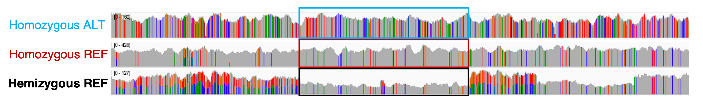

  # J LOH

*[Still the one from the block](https://www.youtube.com/watch?v=dly6p4Fu5TE)*

A tool to extract blocks of loss of heterozygosity (LOH) based on single-nucleotide polymorphisms (SNPs), read mapping, and a reference genome.


## Table of Contents

- [Install](#Install)
- [Run](#Run)
- [Implementation](#Implementation)
- [Output](#Output)
- [Interpreting output](#Interpreting output)
- [Nextflow workflow](#Nextflow workflow)

## Install

As simple as: `git clone https://github.com/Gabaldonlab/jloh.git`
And it's ready to go! But there are a few dependencies:

| Program     | Type        | Version | Links      |
|-------------|-------------|---------|------------|
| pybedtools  | Module      | 0.8.2   | [source](https://daler.github.io/pybedtools/main.html), [cite](https://doi.org/10.1093/bioinformatics/btr539) |
| pysam       | Module      | 0.1.7   | [source](https://pypi.org/project/pysam/), [cite](https://github.com/pysam-developers/pysam) |
| Python      | Interpreter | 3.6.1   | [source](https://www.python.org/downloads/release/python-397/), [cite](http://citebay.com/how-to-cite/python/) |

Note that **pybedtools** will look for [bedtools](https://bedtools.readthedocs.io/en/latest/) in the `$PATH`, while **pysam** will look for [samtools](http://www.htslib.org/). Hence, you may have to install these two programs as well.  

## Run

The basic usage of the program is as simple as:

```
./jloh --threads <num_threads> --vcf <VCF> --genome-file <GENOME_FILE> --bam <BAM> [options]
```

To produce a genome file, simply calculate the length of each sequence in your reference FASTA file and produce a file containing their name + length, structured in a tab-separated format that looks like this:

```
chr1  89214414
chr2  1231455
chr3  90804782
...
```

## Implementation

This section describes in detail what you can achieve with **JLOH**. Later in this guide, a nextflow workflow to go from reads to LOH blocks is also described.

### sorting of SNPs by zygosity

The variants passed with `--vcf` are scanned, subdividing heterozygous and homozygous SNPs into two separate files: `<sample>.het_snps.vcf` and `<sample>.homo_snps.vcf`. Indels and other types of variation are discarded. The heterozygous SNPs are used to extract regions containing heterozygosity, while the homozygous SNPs are used to assign homozygous regions to either the alternative (ALT) or the reference (REF) allele; this is done by default, unless the user passes the `--no-alleles` option (see later). The selection of heterozygous SNPs is conducted based on their `FORMAT` (e.g. `GT 0/1` or `1/2` for heterozygous SNPs). Selected SNPs should also have an allele frequency (`AF`) annotation, and are retained if their `AF` is larger than `--min-af` and lower than `--max-af`.

Missing allele frequency? Try using [all2vcf](https://github.com/MatteoSchiavinato/all2vcf).

### extraction of heterozygous regions

Heterozygous regions are extracted based on clusters of heterozygous SNPs. The minimum number of SNPs per kbp is defined with `--min-snps-kbp` parameter, which eliminates regions with too little SNPs. The maximum SNP distance (`--snp-distance`) defines how far can the SNPs be within one cluster. This produces a list of heterozygous regions that will then be ignored in LOH block detection.

### Extraction of candidate blocks

Everything that did not include sufficient heterozygous SNPs is then screened as a potential LOH block. First, the complementary intervals of the heterozygous ones are extracted. Then, the program makes a choice depending on the `--no-alleles` settings:

- If not set, the same procedure used for the heterozygous SNPs is repeated to extract clusters of **homozygous** SNPs. These indicate that the candidate LOH block has retained an alternative allele (i.e. `ALT`), different from the one in the reference genome. Regions without homozygous SNPs confirm, instead, the reference allele (i.e. `REF`). The identified intervals are then used to subdivide candidate blocks into **ALT** and **REF**.

- If set, JLOH does not perform the ALT/REF analysis and assigns an arbitrary `NA` allele annotation to all candidate blocks. Depending on the species you work with (hybrid, poorly assembled, etc.) this may be a safe choice.

Regardless of the choice, at the end of this block of operations JLOH has a list of potential LOH blocks i terms of chromosome, start, end, number of SNPs, and length. Blocks shorter than `--min-size` are at this point filtered out. The remaining ones are screened against the initial heterozygous regions: overlapping regions are cropped from the candidate LOH block coordinates.

### Coverage trimming

Candidate blocks are screened against the coverage profiles of each chromosome using the BAM file passed with `--bam`. Regions of candidate blocks that don't have any coverage are trimmed, reducing the candidate block coordinates only to the covered portion of it. In case this makes it too short, i.e. shorter than `--min-size`, the block is consequently discarded. Each block must also pass a *covered fraction* filter (the fraction of positions actually covered by reads). If the fraction is lower than `--min-frac-cov`, the block is discarded.

### Determination of block zygosity

The coverage information is then used to infer the zygosity of a block. In case the `--no-alleles` option is set, this step is skipped. If not skipped, the upstream and downstream regions of each block are extracted. The extent of the up/downstream region is regulated by the `--overhang` parameter. If both up- and downstream regions show the same trend (e.g. both have 2x the coverage of the block), then the block's zygosity is inferred. There are two zygosity types: `homo` and `hemi`. This combines together with the presence or absence of homozygous SNPs in four possible scenarios (see image in the **Interpreting Output** chapter below).


### deal with known pre-existing LOH blocks

The last block of operations is aimed at comparing the detected LOH blocks with any pre-existing ones. This is an *optional* step and is not performed unless the user passes another VCF file with the `-t0-vcf` option. This file will be considered as variation that pre-dates the one listed in `--vcf`.

This "t0" variation is used to extract LOH blocks the same way as described for the input VCF file. The user can then choose what to do with it with the `--t0-filter-type` option. The default ("remove") will remove any overlapping LOH block found between the "t0" VCF and the input VCF. This reduces the output LOH blocks only to those unique to the input VCF. Some users however may want to keep only blocks that are found in "t0" too. To do that, one just has to specity `--t0-filter-type keep`.

By default, JLOH won't expect a "t0" dataset and will go through this step without doing anything.

## Output

**JLOH** produces the following output files:

- `<sample>.LOH_blocks.tsv`: the main output of the file. The first three columns represent the genomic ranges where LOH blocks have been found. These can be easily cut to produce a BED file. It also contains: the relative coverage with respect to the genome mean coverage (`#4`), the length of the block (`#5`), the allele to which it has been assigned (`#6`), the number of homozygous SNPs found within it (`#7`) and the number of heterozygous SNPs found within it (`#8`).

- `<sample>.exp.LOH_candidates.tsv`: this file contains candidate LOH blocks that have been discarded due to any of the reasons why the script discards a block (coverage, length, number of SNPs contained). These blocks are placed in this file for debugging reasons and for the user to be aware of what is not kept.

- `<sample>.exp.het_snps.vcf`: VCF file containing the heterozygous SNPs isolated from the input VCF.

- `<sample>.exp.homo_snps.vcf`: VCF file containing the homozygous SNPs isolated from the input VCF.

Note: if a `--t0-vcf` and a `-t0-bam` file are passed, there will be extra files with the same naming system corresponding to these input files. These will carry the label "t0" instead of "exp".

## Interpreting output

JLOH's main output is a table containing all candidate LOH blocks. These blocks are annotated with various information on them, but the interpretation is strongly case-specific, hence is left to the user. We strongly advice the user to load the input VCF, BAM, and the output TSV to a genome browser such as [IGV](https://software.broadinstitute.org/software/igv/). The output TSV's first three columns are already a BED file (0-based, half-open intervals) and can be used as they are.

Ideally, LOH blocks assigned as `REF` should match regions that are covered by reads but depleted of *homozygous* SNPs, while those assigned as `ALT` should match regions dense in *homozygous* SNPs. Detected LOH blocks (regardless of the annotation) should not overlap regions that are dense in *heterozygous SNPs*.

In terms of zygosity, regions annotated as *homo* should have a read coverage that is higher or equal to the value set with the `--hemi` parameter (default: 0.75, i.e. 75%). Regions annotated as *hemi* should have a read coverage that is below this value.

An example as seen in IGV is provided below.  



## Nextflow workflow

Together with the **JLOH** tool, we provide also a [Nextflow](http://nextflow.io/) workflow that you can use to run your samples directly from raw reads to LOH blocks. All you have to do is to edit the configuration file of the workflow (\*config) and the running script (\*sh). Edit them according to your own computer / server, and then run:

`bash reads_to_LOH_blocks.sh`

In case you're working on a cluster with a slurm queuing system, you can edit the `#SBATCH` lines at the beginning and then run:

`sbatch reads_to_LOH_blocks.sh`
