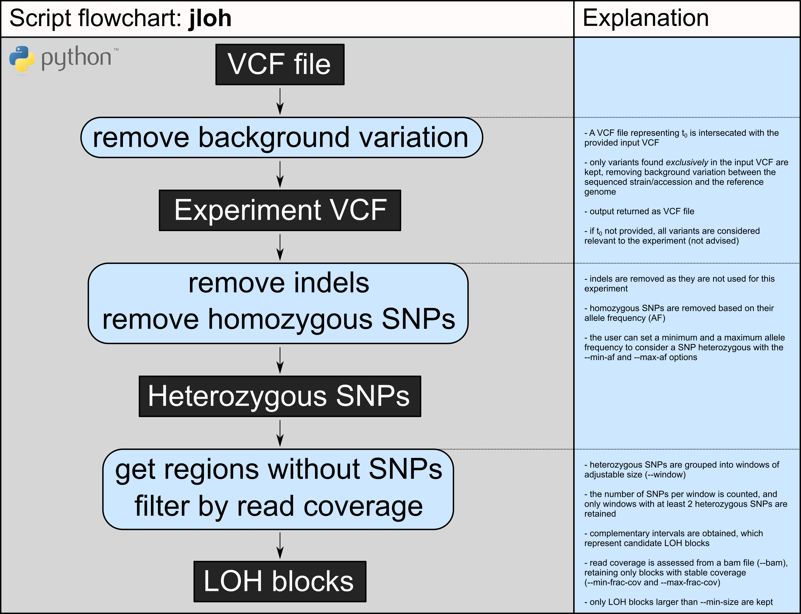

# J LOH

*[Still the one from the block](https://www.youtube.com/watch?v=dly6p4Fu5TE)*

A tool to extract blocks of loss of heterozygosity (LOH) based on single-nucleotide polymorphisms (SNPs) and a reference genome.



## Install

As simple as: `git clone https://github.com/Gabaldonlab/jloh.git` or `https://github.com/MatteoSchiavinato/jloh.git`
And it's ready to go!

### Dependencies

| Program     | Type        | Version | Links      |
|-------------|-------------|---------|------------|
| Bedtools    | Program     | 2.25    | [source](https://bedtools.readthedocs.io/en/latest/), [cite](https://doi.org/10.1093/bioinformatics/btq033) |
| pysam       | Module      | 0.1.7   | [source](https://pypi.org/project/pysam/), [cite](https://github.com/pysam-developers/pysam) |
| Python      | Interpreter | 3.6.1   | [source](https://www.python.org/downloads/release/python-397/), [cite](http://citebay.com/how-to-cite/python/) |

## Run

The basic usage of the program is as simple as:

```
./jloh --vcf <VCF> --genome-file <GENOME_FILE> --bam <BAM> [options]
```

To produce a genome file, simply calculate the length of each sequence in your reference FASTA file and produce a file containing their name + length, structured in a tab-separated format that looks like this:

```
chr1  89214414
chr2  1231455
chr3  90804782
...
```

The program has many other options:

```
Usage:
./jloh --vcf <VCF> --genome-file <GENOME_FILE> --bam <BAM> [options]

[mandatory]
--vcf               Input VCF file containing all types of variants             [!]
--genome-file       File with chromosome lengths (chromosome <TAB> size)        [!]

[optional]
--sample            Sample name / Strain name for output files                  [loh_blocks]
--output-dir        Output directory                                            [loh_blocks_out]
--t0-vcf            VCF with variants to ignore from --vcf                      [off]
--min-het-snps      Min. num. of heterozygous SNPs in heterozygous region       [2]
--snp-distance      Min. distance (bp between SNPs for blocks definition        [100]
--min-size          Min. LOH block size                                         [100]
--min-af            Min. allele frequency to consider a variant heterozygous    [0.3]
--max-af            Max. allele frequency to consider a variant heterozygous    [0.7]
--bam               BAM file (only required when filtering by coverage)         [off]
--min-frac-cov      Min. mean coverage fraction for LOH blocks                  [0.75]
                    (used only if --bam specified)
--max-frac-cov      Max. mean coverage fraction for LOH blocks                  [1.25]
                    (used only if --bam specified)
--block-lengths     Comma-sep. list of desired distances between LOH blocks     [100,1000,5000]
--bedtools          Path to the bedtools executable                             [bedtools]
--print-info        Show authors and edits with dates                           [off]
```

## Output

#### selection of relevant variants

The program produces many output files. First, the variants passed as input VCF file are compared to those (if any) passed as `--t0-vcf`. If the latter option is used, all variants contained in both VCF files are excluded, as a means to exclude variation preexisting the experiment. If the `--t0-vcf` option is not used, then all variants passed as input are retained. In both cases, the retained variants are saved in a VCF file called `<sample>.relevant.vcf`.

#### selection of heterozygous SNPs

The relevant variants are then filtered, retaining only heterozygous SNPs. Indels and homozygous SNPs are filtered out as they aren't normally used to extract LOH blocks. The selection of heterozygous SNPs is conducted based on their FORMAT field (field number 9 and 10 of a VCF file). The first column of this field carries a series of annotations separated by colons (e.g. GT:AF) the values of which are annotated the same way on the second column (e.g.` 0/1:0.60`). If a SNP is annotated as heterozygous, it will carry a genotype (`GT`) such as `0/1` or `1/2`. It should also have an allele frequency (`AF`) annotation. SNPs are considered heterozygous if their `AF` annotation falls between the values specified with `--min-af` and `--max-af`. The heterozygous SNPs are then saved in a VCF file called `<sample>.het_snps.vcf`.

#### extraction of heterozygosity regions

The putative heterozygosity regions are extracted based on the number of heterozygous SNPs they contain, and the maximum distance between these SNPs for them to be considered part of the same region. These parameters are controlled with the `--min-het-snps` and the `--snp-distance` parameters. The default values for these two parameters (`--min-het-snps 2 --snp-distance 100`) are those used in many studies. This step uses **bedtools merge** to create BED intervals that fit these criteria. The number of SNPs is assessed with the `bedtools merge -c 1 -o count` option, while the distance is assessed with the `-d` parameter. This step produces three output files: 1) a file called `<sample>.d<snp_distance>bp_provisory.bed` where sample and snp distance depend on the parameters the used passed; 2) output BED file that contains the length of each interval, called the same way but with a `*w_len.bed` ending; 3) the actual output file, filtered by `--min-het-snps` and `--snp-distance`, called `<sample>.d<snp_distance>bp.bed`.

#### extract complementary homozygous regions

The objective of this tool is to extract LOH blocks, which are defined by the *loss* of  heterozygosity. Hence, the tool at this point selects the complementary intervals to those that were labelled as heterozygous. This is done with **bedtools complement**. The output file is called `<sample>.d<snp_distance>bp.complement.bed`. These regions are then filtered by their length, retaining only those with a length larger or equal to `--min-size`. This produces an output file called `<sample>.homo.d<snp_distance>bp.bed`.

#### filter by coverage

Each region that is considered as a candidate LOH region is screened by coverage using the BAM file passed with `--bam`. First, a mean coverage is computed for the whole BAM file. To do that, JLOH checks if the BAM file is indexed, and if not, it indexes it using the **pysam** module. Then, reads mapping inside each region are extracted using the **pysam** module, and compared against the general mean coverage. Candidate LOH blocks are retained in the output only if they have a coverage *below* or *above* what is considered "normal" coverage. The "normal" coverage range is defined via two parameters: `--min-frac-cov` and `--max-frac-cov`. The defaults of these two parameters (0.75 and 1.25) are used in many studies. The global mean coverage computed from the BAM file is multiplied by these two values to obtained the two boundaries of "normal" coverage. Every candidate LOH block falling above or below these two thresholds will be considered a true LOH block. True LOH blocks are placed in an output file called `<sample>.LOH_blocks.bed`. This is the true output of the program, and one of the only two that are not placed in the `process` folder, where temporary files are stored.
