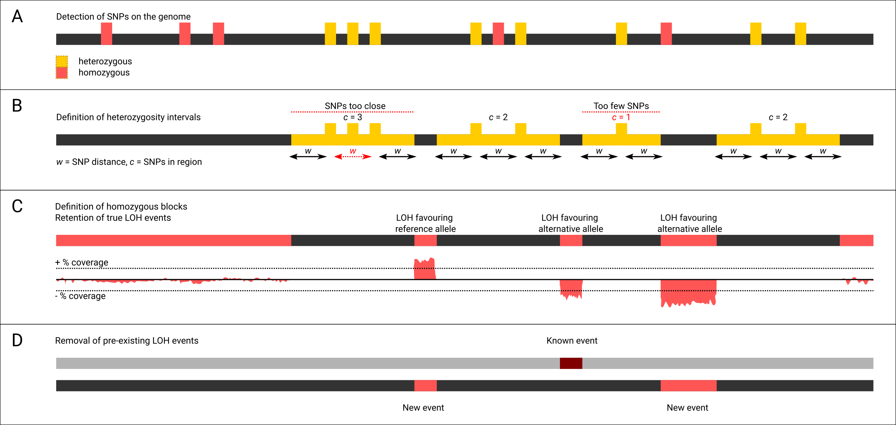

# J LOH

*[Still the one from the block](https://www.youtube.com/watch?v=dly6p4Fu5TE)*

A tool to extract blocks of loss of heterozygosity (LOH) based on single-nucleotide polymorphisms (SNPs), read mapping, and a reference genome.



## Install

As simple as: `git clone https://github.com/Gabaldonlab/jloh.git` or `https://github.com/MatteoSchiavinato/jloh.git`
And it's ready to go! But there are a few dependencies:

| Program     | Type        | Version | Links      |
|-------------|-------------|---------|------------|
| Bedtools    | Program     | 2.25    | [source](https://bedtools.readthedocs.io/en/latest/), [cite](https://doi.org/10.1093/bioinformatics/btq033) |
| pybedtools  | Module      | 0.8.2   | [source](https://daler.github.io/pybedtools/main.html), [cite](https://doi.org/10.1093/bioinformatics/btr539) |
| pysam       | Module      | 0.1.7   | [source](https://pypi.org/project/pysam/), [cite](https://github.com/pysam-developers/pysam) |
| Python      | Interpreter | 3.6.1   | [source](https://www.python.org/downloads/release/python-397/), [cite](http://citebay.com/how-to-cite/python/) |

Note that **pybedtools** will look for **bedtools** in the `$PATH`.

## Run

The basic usage of the program is as simple as:

```
./jloh --vcf <VCF> --genome-file <GENOME_FILE> --bam <BAM> [options]
```

To produce a genome file, simply calculate the length of each sequence in your reference FASTA file and produce a file containing their name + length, structured in a tab-separated format that looks like this:

```
chr1  89214414
chr2  1231455
chr3  90804782
...
```

The program has many other options:

```
[mandatory]
--vcf               Input VCF file containing all types of variants             [!]
--genome-file       File with chromosome lengths (chromosome <TAB> size)        [!]
--bam               BAM file used to call the --vcf variants                    [!]

[optional]
--filter-mode       "pass" to keep only PASS variants, "all" to keep everything [all]
--sample            Sample name / Strain name for output files                  [loh_blocks]
--output-dir        Output directory                                            [loh_blocks_out]
--t0-vcf            VCF with variants to ignore from --vcf                      [off]
--t0-bam            BAM file used to call the --t0-vcf variants                 [off]
--t0-filter-type    What to do with t0 LOH events? "keep" or "remove"           [remove]
--min-het-snps      Min. num. heterozygous SNPs in heterozygous region          [2]
--snp-distance      Max. distance (bp between SNPs for blocks definition        [100]
--block-dist        Combine LOH blocks into one if closer than this distance    [100]
--min-size          Min. LOH block size                                         [100]
--min-af            Min. allele frequency to consider a variant heterozygous    [0.3]
--max-af            Max. allele frequency to consider a variant heterozygous    [0.7]
--debug             Activate generation of several intermediate files           [off]
--print-info        Show authors and edits with dates                           [off]
```

## The workflow, described

### selection of SNPs

The variants passed with `--vcf` are filtered, retaining only heterozygous SNPs which are placed in an output file called `<sample>.het_snps.vcf`. Homozygous SNPs are placed in another output file called `<sample>.homo_snps.vcf`. Indels and other types of variation are discarded. The heterozygous SNPs are used to extract regions containing heterozygosity, while the homozygous SNPs are used to assign homozygous regions to either the alternative (ALT) or the reference (REF) allele. The homozygous SNPs used in the script are limited to those non-overlapping the heterozygous regions; however, the  `<sample>.homo_snps.vcf` file contains all of them.

The selection of heterozygous SNPs is conducted based on their FORMAT field (field number 9 and 10 of a VCF file). The first column of this field carries a series of annotations separated by colons (e.g. GT:AF) the values of which are annotated the same way on the second column (e.g.` 0/1:0.60`). If a SNP is annotated as heterozygous, it will carry a genotype (`GT`) such as `0/1` or `1/2`. It should also have an allele frequency (`AF`) annotation. SNPs are considered heterozygous if their `AF` annotation falls between the values specified with `--min-af` and `--max-af`.

### extraction of heterozygosity and homozygosity regions

#### The `--no-alleles` setting

There are two use-cases:
- You have a VCF with SNPs obtained from **reads from a species** mapped onto **its genome**. In this case, use the `--no-alleles` option because alleles are for the second use-case.
- You have a VCF with SNPs obtained from **reads from a hybrid species** mapped onto the **genome of a parental species**. In this case you may want to assign LOH blocks to either one of the parental species. In that case, DO NOT set `--no-alleles`: the tool will use homozygous SNPs to attempt this inference.

#### Extraction of the blocks

The heterozygous regions are extracted based on clusters of heterozygous SNPs. The minimum number of SNPs eliminates regions with too little SNPs to be considered true positives, while the maximum SNP distance defines how the SNPs are clustered. These parameters are controlled with the `--min-het-snps` and the `--snp-distance` parameters. This step produces a list of genomic intervals defining the clusters, including the number of SNPs contained in them.  

In case the `--no-alleles` option is left off (i.e. not set), the same procedure is then repeated to extract clusters of **homozygous** SNPs. These indicate candidate LOH regions that carry an allele different from the reference genome (i.e. `ALT`) on which reads are mapped. This is useful when working with reads from a hybrid species mapped against a parental genome: if they carry lots of homozygous SNPs, this indicates that the LOH block has retained the allele of the other parental (i.e. not the one where you mapped the reads).

A third list of intervals is then produced, which contains all those intervals complementing the first two. That is, every interval that is neither heterozygous nor homozygous for `ALT`. These are labelled `REF` and indicate intervals where the SNP profile points in the direction of an LOH towards the reference allele (i.e. the one of the reference genome). If the user set the `--no-alleles` option, this is not done.

All intervals (`REF` and `ALT`) are then checked against the heterozygous blocks and their margins are **edited** until they don't overlap with heterozygous blocks anymore. If the user set the `--no-alleles` option, this is not done and each LOH block will be annotated as `NA` in the `Allele` column of the output file.

### computing coverage

#### How coverage is used

Each region that is considered as a candidate LOH region is screened by coverage using the BAM file passed with `--bam`. First, a mean coverage is computed for the whole BAM file. To do that, JLOH checks if the BAM file is indexed, and if not, it indexes it using the **pysam** module. Then, reads mapping inside each region are extracted using the **pysam** module, and compared against the general mean coverage.

Each block is then checked in terms of *covered fraction*. This is the fraction of its positions that are actually covered. This is done to avoid keeping blocks that have only a handful of covered positions inside. If the fraction is lower than `--min-frac-cov`, the block is discarded.

#### The `--keep-secondary` option

The user may want to use only primary alignments for their analysis. This is strongly recommended and is commonly done, to avoid coverage overestimations determined by multi-mapping reads with many secondary alignments. The default behaviour is to remove secondary alignments from the input provided with `--bam`. A filtered bam file is placed in the output directory, together with a bam index.

If the user sets the `--keep-secondary` option, all provided reads are used. This may be useful to assess impact of secondary alignments on your analysis, but is not recommended unless you know what you're doing.

#### Interpreting coverage

No assumption is made on what coverage should be within an LOH block. However, in case you're working *with* alleles, a general rule would say that:
- if the REF allele is retained, coverage should be higher than the mean coverage
- if the ALT allele is retained, coverage should be lower because fewer reads are able to map

However, depending on how the user conducted the mapping, this may or may not be true for each case. Hence, a decision was made to let the user decide how to filter the output file at will.

If the user set the `--no-alleles` option, this is not important.

### deal with known pre-existing LOH blocks

If the user passes another VCF file with the `-t0-vcf` option, this file will be considered as variation that pre-dates the one listed in `--vcf`. This "t0" variation is used to extract LOH blocks the same way as described for the input VCF file. The user can then choose what to do with it with the `--t0-filter-type` option. The default ("remove") will remove any overlapping LOH block found between the "t0" VCF and the input VCF. This reduces the output LOH blocks only to those unique to the input VCF. Some users however may want to keep only blocks that are found in "t0" too. To do that, one just has to specity `--t0-filter-type keep`.

If the user did not specify any `--t0-vcf`, this file will be identical to `<sample>.LOH_blocks.bed`.

## Output

**JLOH** produces the following output files:

- `<sample>.LOH_blocks.tsv`: the main output of the file. The first three columns represent the genomic ranges where LOH blocks have been found. These can be easily cut to produce a BED file. It also contains: the relative coverage with respect to the genome mean coverage (`#4`), the length of the block (`#5`), the allele to which it has been assigned (`#6`), the number of homozygous SNPs found within it (`#7`) and the number of heterozygous SNPs found within it (`#8`).

- `<sample>.exp.LOH_candidates.tsv`: this file contains candidate LOH blocks that have been discarded due to any of the reasons why the script discards a block (coverage, length, number of SNPs contained). These blocks are placed in this file for debugging reasons and for the user to be aware of what is not kept.

- `<sample>.exp.het_snps.vcf`: VCF file containing the heterozygous SNPs isolated from the input VCF.

- `<sample>.exp.homo_snps.vcf`: VCF file containing the homozygous SNPs isolated from the input VCF.

Note: if a `--t0-vcf` and a `-t0-bam` file are passed, there will be extra files with the same naming system corresponding to these input files. These will carry the label "t0" instead of "exp".
