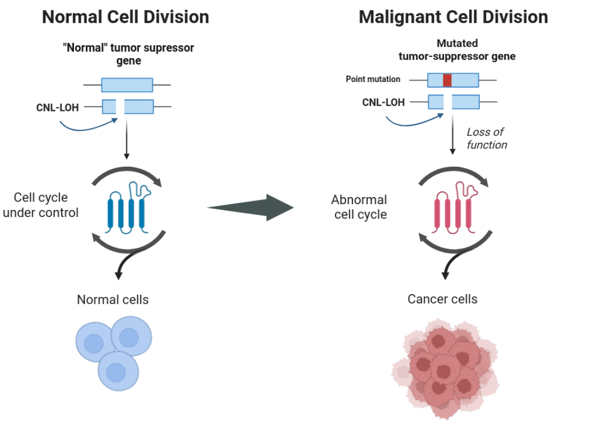

.. _cancer-wf:

Working with cancer data
========================

Another area of research in which LOH has been extensively studied is cancer. Cancer cells exhibit several mutations and events altering its heterozygous levels, including LOH, which contributes to tumor progression and resistance to treatment.

During this section, we guide you through the necessary steps to obtain successful LOH block interference with cancer datasets.

.. tip:: 
    
    If you are working with a tumoral sample that has no matching control, you may follow these guidelines but apply them only to the tumoral sample you have. A distinction in workflow will appear only at the level of running Jloh.

Remove secondary alignments
---------------------------

Most mappers will return more than one mapping location for each read in the output SAM file. Each read derives from a fragment of DNA, and therefore belongs to a unique spot in the genome, not plenty. It is therefore important to remove secondary alignments and keep only the best one in order to avoid coverage inflation and false SNP detection.
To do so, simply use `samtools <http://www.htslib.org/download/>` and its view module, removing records with the “secondary” bitwise flag (-F 0x0100) and those with the “unmapped” bitwise flag to save disk space (-F 0x4). Here in the example, we’re taking advantage of multithreading (-@ 20). We’re also piping the view command to the sort command to sort the output BAM directly by genome coordinate.

.. code-block::

    samtools view -@ 20 -h -b -F 0x0100 -F 0x4 my_alignment.sam | \
    samtools sort -@ 20 \
    > my_filtered_alignment.bam

Repeat this operation for both alignments (control and tumoral sample) of the same individual.

Call variants
-------------

The variant calling procedure does not need any significant retouch and can be performed any way the user wants, as long as it produces a VCF file that contains both homozygous and heterozygous SNPs at somatic level.

Some users perform variant calling combining `bcftools <http://www.htslib.org/download/>`_ mpileup and call. Other users prefer the `GATK <https://gatk.broadinstitute.org/hc/en-us>`_ pipeline.

Add allele frequency if missing
-------------------------------

A final, crucial step before running “onco_extract” is to possess allele frequency (AF) as an annotation in the VCF file in the FORMAT field. This can be done manually with simple scripts but we suggest doing it with `all2vcf <https://github.com/MatteoSchiavinato/all2vcf>`_, which has a module called frequency taking care of that exactly. A distribution of `all2vcf <https://github.com/MatteoSchiavinato/all2vcf>`_ is already included with JLOH (src/all2vcf).

Once your VCF files contain the AF annotation in the FORMAT field, they’re good to go for running JLOH “onco_extract”.

Infer LOH blocks in cancer datasets
-----------------------------------

This step is performed by jloh :ref:`onco_extract`. Differently from the default program setup described in :ref:`quickstart` and :ref:`test-data`, when working with cancer datasets this module is used instead of the extract module.

Infer blocks with matched tumor/normal pairs
^^^^^^^^^^^^^^^^^^^^^^^^^^^^^^^^^^^^^^^^^^^^

The user will be asked to provide the reference genome (`--ref`), two BAM files (`--bams`) and two VCF files (`--vcfs`) from the paired sample (control, tumor in this order). These are the files you generated in the step above, following this guide.

Together with these parameters, you can also pass the `--min-snps` and `--min-snps-het` parameters to adjust to your study case and reduce the effect of heterozygous clusters on LOH block calling. If you possess a list of regions of interest, you can also pass the file (BED format) with `--regions`.

All the other parameters are described in :ref:`onco_extract`. 

.. note:: 
    
    As for now, the last version of JLOH does not include the parallelization of :ref:`onco_extract` nor the use of :ref:`jloh-stats`. 

Here's an example command with a matched tumor/normal pair: 

.. code-block::

    jloh onco_extract \
    --ref genome.fa \
    --bams mapping_control.bam mapping_tumor.bam \
    --vcfs variants_control.vcf variants_tumor.vcf \
    --min-snps 2 \
    --min-snps-het 4

.. tip::

    By default, :ref:`onco_extract` keeps every candidate block that is at least 100 bp long. As human cancer datasets have overall low heterozygosity levels when compared to other evolutionary contexts (< 1%) this aspect should be taken with care to avoid an increase of false positives. To account for that, the minimum length may be increased with `--min-length`.

Infer blocks with only a tumor sample
^^^^^^^^^^^^^^^^^^^^^^^^^^^^^^^^^^^^^

If you’re working in a cancer setup but only have one sample from the individual (tumoral sample) you can still use jloh. 

When running jloh onco_extract, you should run it in single sample mode (i.e. activate `--single-mode` flag). Pass the BAM and VCF file that you have generated as `--bam` and `--vcf` respectively (note the difference from `--bams` and `--vcfs`). 

Blocks called by jloh should be taken with a grain of salt if no information from the control sample is present, as a larger proportion of false positives will be present. 

Here's an example command:

.. code-block::

    jloh onco_extract \
    --single-mode True \
    --ref genome.fa \
    --bam mapping_tumor.bam \
    --vcf variants_tumor.vcf \
    --min-snps 2 \
    --min-snps-het 4 