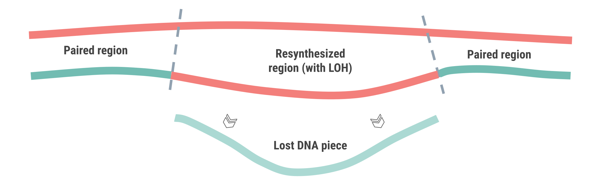
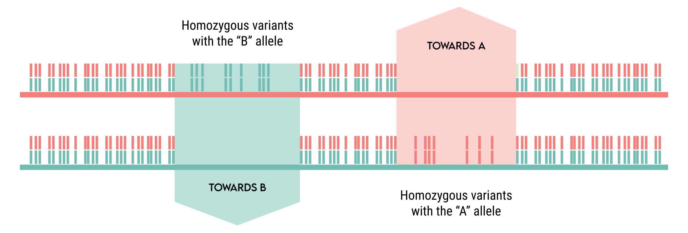
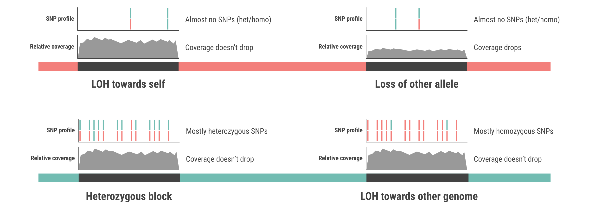

.. _hybrid-wf:

Working with hybrids
====================

One area of research in which LOH is particularly studied is the one of hybrids (`Mixão et al., 2022 <https://doi.org/10.1186/s12915-023-01608-z>`_). Hybrids are organisms whose parents come from very divergent populations of the same species (intra-specific hybrids) or directly from different species (inter-specific hybrids).

In hybrids, LOH tends to reduce differences between subgenomes. Whenever one piece of DNA is damaged or lost, the other subgenome is used as template to regenerate it. This process leads to loss of the heterozygosity that was present in that stretch, and if the new arrangement of alleles is increasing the fitness, it fixates in the population. 

Hence, to study LOH in hybrids with NGS data people sequence the hybrid species and then map the derived reads onto its parental genome sequences. This approach is not error-free: the inherent divergence between the two parental genomes may hinder proper read mapping, as we show in our publication (`Schiavinato et al., 2023 <https://doi.org/10.1101/2023.05.04.539368>`_).

In this page we guide you through the steps necessary to produce a successful LOH block inference with hybrid data. 

.. tip:: 

    If you only have one parental genome sequence, follow this other workflow instead: :ref:`one-parent`.

Map hybrid reads onto parentals 
-------------------------------

You must map the reads extracted from the hybrid (i.e. containing both subgenomic components) against one parental genome at a time. For simplicity, we will refer to the subgenomes as A and B from now on. 

The mapping operation must be carried out in a way that allows sufficient mismatches between the reads and the reference, so that reads from both A and B may map against the parental A (or B). If both subgenomic components map against a parental genome, you'll see heterozygous SNPs in the final VCF files and you'll be able to infer LOH blocks. 

Estimate mismatches allowed
^^^^^^^^^^^^^^^^^^^^^^^^^^^

If you're using `HISAT2 <http://daehwankimlab.github.io/hisat2>`_ or `bowtie2 <https://bowtie-bio.sourceforge.net/bowtie2/index.shtml>`_, the parameter that allows you to fine-tune the mapping tolerance is ``--score-min``. This parameter defines a scoring function that allows a number of mismatches correlated with the read length. 

The default HISAT2 values are ``--score-min L,0.0,-0.2 --mp 6,2`` (scoring function and mismatch penalty). With reads that are 125 nt long, this is the calculation performed: 

.. code-block:: 

    Max penalty = (125 * -0.2) + 0.0 = -25 
    Max mismatches = 25 / 6 = 4.2 --> 4 mismatches 

Hence, increasing the absolute value in the third field of the ``--score-min`` argument will accomodate more mismatches. For example, bringing it to -0.8 would mean: 

.. code-block:: 

    Max penalty = (125 * -0.8) + 0.0 = -100 
    Max mismatches = 100 / 6 = 16.7 --> 16 mismatches 

To properly choose this parameter, you must know an estimate of the divergence between the two subgenomes of your hybrid. If their divergence is 5%, you can expect 5 mismatches every 100 bp. This means that reads of L=100 from B will map onto A only if the mapping algorithm can accomodate at least 5 mismatches. If reads were L=125 (as in the above example), it should accomodate at least 6.25 mismatches (approx. 6). 

Here's a practical conversion formula to set your ``--score-min``, with ``div`` being divergence (1-100), ``pen`` being the mismatch penalty (default: 6 in HISAT2), ``f`` being the absolute value in the ``--score-min`` argument (e.g. 0.2, without the sign). 

.. code-block::

    f = ((div / 100) * pen)

    Leading to:
    --score-min L,0.0,-f

Hence, we suggest as a good rule of thumb to set the mapping parameters in a way that they accomodate slightly more mismatches than those required by the subgenomic divergence (e.g. 7-8 mismatches when working with L=125 and div=5%).

.. note:: 

    Once you estimated the number of mismatches and set the mapping parameters accordingly, you must repeat the mapping twice: once onto the A parental genome, and once onto the B parental genome. 

Remove secondary alignments 
^^^^^^^^^^^^^^^^^^^^^^^^^^^

Most mappers will return more than one mapping location for each read in the output SAM file. Each read derives from a fragment of DNA, and therefore belongs to a unique spot in the genome, not plenty. It is therefore important to remove secondary alignments and keep only the best one in order to avoid coverage inflation and false SNP detection. 

To do so, simply use `samtools <http://www.htslib.org/download/>`_ and its **view** module, removing records with the "secondary" bitwise flag (0x0100) and those with the "unmapped" bitwise flag to save disk space (0x4). Here in the example, we're taking advantage of multithreading (-@ 24). We're also piping the **view** command to the **sort** command to sort the output BAM directly by genome coordinate. 

.. code-block:: bash 

    samtools view -@ 24 -h -b -F 0x0100 -F 0x4 my_alignment.sam | \
    samtools sort -@ 24 \
    > my_filtered_alignment.bam 

Repeat this operation for both alignments (A and B). 

Call variants
-------------

The variant calling procedure does not need any significant retouch and can be performed any way the user wants, as long as it produces a VCF file that contains both homozygous and heterozygous SNPs. 

Some users perform variant calling combining `bcftools <http://www.htslib.org/download/>`_ **mpileup** and **call**. Other users prefer the `GATK <https://gatk.broadinstitute.org/hc/en-us>`_ pipeline. 

Add allele frequency if missing
^^^^^^^^^^^^^^^^^^^^^^^^^^^^^^^

A final, crucial step before running JLOH is to add allele frequency (``AF``) as an annotation to the VCF file in the ``FORMAT`` field. This can be done manually with simple scripts but we suggest to do it with `all2vcf <https://github.com/MatteoSchiavinato/all2vcf>`_, which has a module called **frequency** taking care of that exactly. A distribution of `all2vcf <https://github.com/MatteoSchiavinato/all2vcf>`_ is already included with JLOH (``src/all2vcf``).

Once your VCF files contain the ``AF`` annotation in the ``FORMAT`` field, they're good to go for running JLOH. 

Run JLOH
--------

Basic information on how to run JLOH can be found in :ref:`quickstart` and :ref:`test-data`. However, when using hybrids, there are some adjustments to be done. 

Analyse parental genomes
^^^^^^^^^^^^^^^^^^^^^^^^

.. note:: 

    This step is optional, but highly suggested. 

This first step is performed by :ref:`jloh-g2g`. This tool maps one parental genome onto the other using `nucmer <https://mummer4.github.io/install/install.html>`_, and finds regions where the two parental genomes have SNPs. These are the regions where LOH could have taken place, as they were different in the parentals. Regions where the genomes were identical in the first place could not have undergone LOH, and would increase false positives. 

Here's a basic command: 

.. code-block:: bash

    jloh g2g --target genome_A.fa --query genome_B.fa 

For further information consult :ref:`jloh-g2g`. In case you need to set the ``--all2vcf-exe`` parameter, remember that a distribution of `all2vcf <https://github.com/MatteoSchiavinato/all2vcf>`_ is already included with JLOH (``src/all2vcf``).

This step is to be performed only once, with both parental genomes. It produces a BED file that you can pass to :ref:`jloh-extract` later on, as argument of the ``--regions`` parameter.

Analyse SNP density distribution
^^^^^^^^^^^^^^^^^^^^^^^^^^^^^^^^

This step is performed by :ref:`jloh-stats`. By modelling SNP density (SNPs/kbp) over each parental genome (i.e. running it twice), you will see how homo/heterozygous your hybrid reads are when compared to each reference. More info on how it works can be found here: :ref:`model-snp-density`.

.. code-block:: bash 

    jloh stats --vcf vars_A.vcf 
    jloh stats --vcf vars_B.vcf 

This step will produce SNP density quantiles for heterozygous and homozygous SNPs (see :ref:`model-snp-density` for details). You must choose a threshold value of SNP density for heterozygous SNPs and one for homozygous SNPs. 

.. tip:: 

    Run this tool twice (once per subgenome) and take the average of the two values chosen for A and the two chosen for B. 

.. note:: 

    The heterozygosity level detected in A and B should be comparable, as it arises from differences between A and B. The homozygosity level, instead, may be different if all the LOH events went towards one of the two subgenomes. If they all went towards A, then B will be full of homozygous SNPs and A will be depleted of them. 

Infer LOH blocks in hybrids
^^^^^^^^^^^^^^^^^^^^^^^^^^^

This step is performed by :ref:`jloh-extract`. Differently from the default program setup described in :ref:`quickstart` and :ref:`test-data`, when working with hybrids the user must use the ``--assign-blocks`` flag. 

The user will be asked to provide two reference genomes (``--refs``), two BAM files (``--bams``) and two VCF files (``--vcfs``). These are the files you generated in the step above, following this guide. 

Together with these parameters, pass also the ``--min-snps-kbp`` parameter with the two values you chose in the previous step (separated by a comma). If you ran :ref:`jloh-g2g` as well, pass the produced BED file as argument to ``--regions``. 

Here, we're leveraging 24 threads from our HPC cluster. All the other parameters are described in :ref:`jloh-extract`. 

.. code-block:: bash 

    jloh extract \
    --refs genome_A.fa genome_B.fa \
    --bams mapping_A.bam mapping_B.bam \
    --vcfs variants_A.vcf variants_B.vcf \
    --min-snps-kbp 8,5 \
    --threads 24

.. tip:: 

    By default, :ref:`jloh-extract` keeps every candidate block that is at least 100 bp long. At low divergence (1-3%) this may inflate false positives. In that case, increase the minimum length. 

Here's a graphical representation of block assignment based on SNP clusters.

When running :ref:`jloh-extract` in ``--assign-blocks`` mode, there are four possible outcomes in terms of blocks, shown in the next figure:

    

Plot LOH blocks
---------------

This step is performed by :ref:`jloh-plot`. Since you're analysing a hybrid with two parental genomes, run it in ``--two-ref`` mode. This mode compares blocks labelled as "REF" with those labelled as "ALT". You can choose what "REF" and "ALT" are, e.g. "Subgenome A" and "Subgenome B". 

.. code-block:: bash 

    # For parent A 

    jloh plot \
    --two-ref \
    --loh subg_A.LOH_blocks.tsv \
    --het subg_A.exp.het_blocks.bed \
    --ref-name Parent_A \
    --alt-name Parent_B 

    # For parent B

    jloh plot \
    --two-ref \
    --loh subg_B.LOH_blocks.tsv \
    --het subg_B.exp.het_blocks.bed \
    --ref-name Parent_B \
    --alt-name Parent_A 

Then, compare the output visually. Strongest LOH candidates are those that show up in both plots (A and B), "REF" in one case and "ALT" in the other. See our publication for an example (`Schiavinato et al., 2023 <https://doi.org/10.1101/2023.05.04.539368>`_).

.. tip:: 

    You can increase or decrease the sensitivity of the plotting engine with the ``--contrast`` and with the ``--window-size`` options (see :ref:`jloh-plot`).